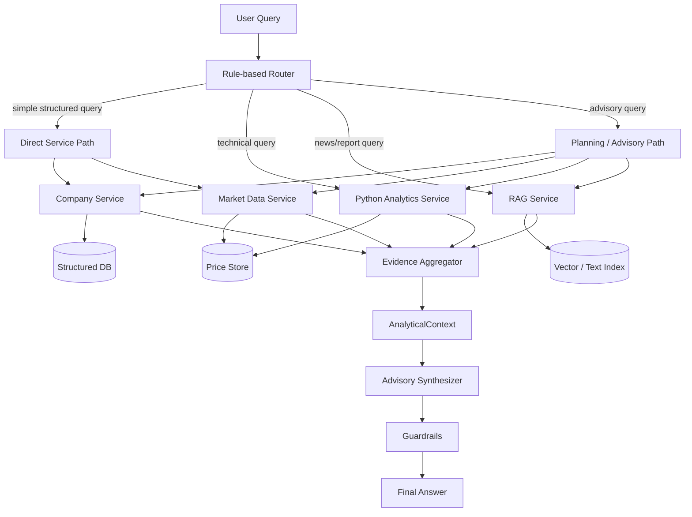
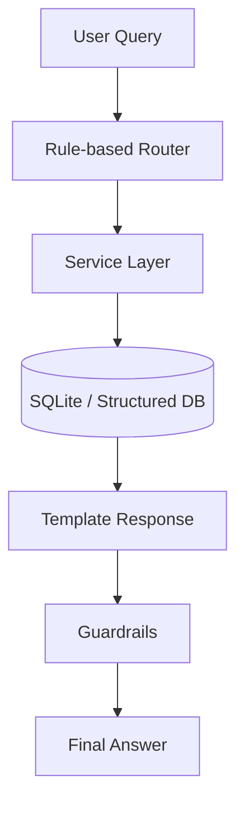
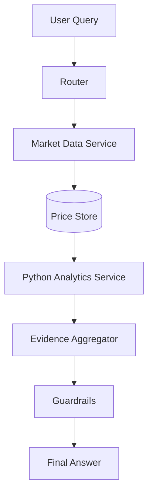
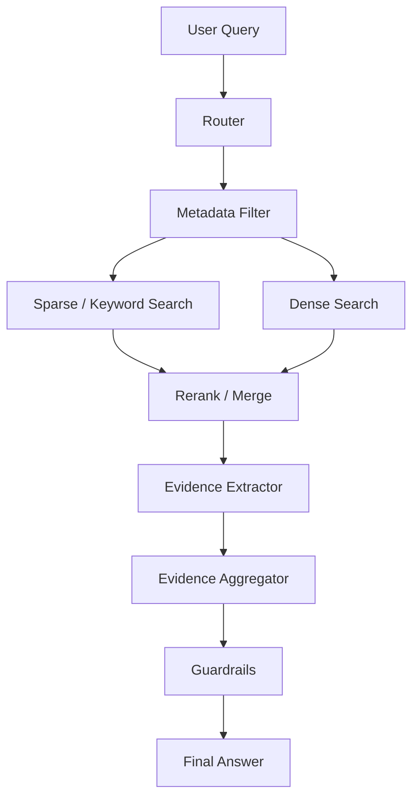
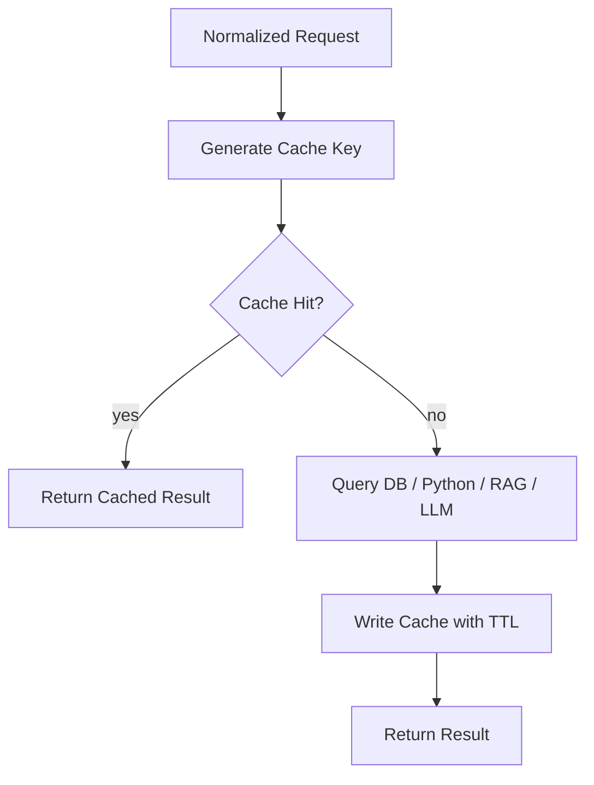

# ARCHITECTURE.md

# Hybrid Agentic RAG Finance Assistant Architecture

## 1. Purpose

This project is a 4-day MVP demo of a Hybrid Agentic RAG architecture for a Vietnamese stock investment assistant.

The goal is not to build a production trading system. The goal is to demonstrate the correct architecture pattern:

- DB-first for structured financial data.
- Python-first for deterministic numeric analytics.
- Hybrid retrieval for unstructured news and report text.
- Agentic orchestration only for complex synthesis.
- Cache for speed and cost reduction.
- Guardrails for safety, evidence checking, and financial disclaimers.

The central design principle:

> The LLM is not the source of truth.

LLMs may help with:
- understanding complex questions,
- planning multi-step workflows,
- synthesizing evidence into natural language.

LLMs must not:
- invent financial facts,
- calculate technical indicators,
- fabricate sources,
- provide personalized financial advice without a risk profile,
- override deterministic service outputs.

---

## 2. MVP Scope

The MVP must support these demo queries:

```txt
FPT niêm yết ở sàn nào?
Giá FPT 3 tháng gần đây thế nào?
Tính RSI14 và SMA20 của FPT.
Tin tức gần đây về HPG là tích cực hay tiêu cực?
FPT có đáng theo dõi không? Nêu lý do và rủi ro.
```

The MVP should demonstrate four paths:

1. Direct DB path.
2. Python analytics path.
3. RAG evidence retrieval path.
4. Advisory synthesis path.

---

## 3. MVP Non-goals

Do not implement these in the 4-day MVP:

```txt
Realtime market data
Full HOSE/HNX/UPCoM ingestion
Corporate action adjustment
Portfolio optimization
Personalized financial advice
Production authentication
ClickHouse production deployment
Kafka/Redpanda event bus
Kubernetes
Complex multi-agent framework
```

These are future roadmap items.

---

## 4. Recommended MVP Stack

```txt
Backend: FastAPI
Frontend: React + Vite
Structured DB: SQLite
Vector/RAG: Chroma local or keyword/BM25 fallback
Analytics: pandas / numpy
Testing: pytest
Cache: simple in-memory dict
LLM: mock synthesizer first, OpenAI-compatible adapter optional
```

Production direction:

```txt
Metadata / Facts / Audit: PostgreSQL
OHLCV / Rollup Analytics: ClickHouse
Raw Files: S3 / MinIO Object Storage
Hybrid RAG: Qdrant
Cache: Redis
Analytics: Python Services
Routing: Rule-based Router + LLM Fallback
Orchestration: Planner + specialized services
Observability: Logs + metrics + audit store
```

---

## 5. High-level Architecture



---

## 6. Core Design Principles

### 6.1 DB-first

Structured facts must come from a database, not from RAG or LLM output.

Examples:
- company name,
- ticker,
- exchange,
- sector,
- financial facts,
- OHLCV prices,
- audit metadata.

In the MVP, SQLite is enough. In production, use PostgreSQL for relational data and ClickHouse for large OHLCV workloads.

---

### 6.2 Python-first

All numeric calculations must be performed by deterministic Python code.

Examples:
- SMA20,
- SMA50,
- RSI14,
- return,
- volatility,
- average volume,
- drawdown.

The LLM may explain these values, but must not calculate them.

---

### 6.3 Hybrid RAG for unstructured text

Use retrieval for:
- news,
- research reports,
- financial report narratives,
- disclosures,
- qualitative risks,
- investment thesis snippets.

Production retrieval should combine:

```txt
Metadata filter
+ Dense retrieval
+ Sparse/BM25 retrieval
+ RRF fusion
+ Reranking
+ Evidence extraction
```

The MVP may use Chroma or a deterministic keyword retrieval fallback.

---

### 6.4 Agentic only when necessary

Not every request should go through a full agentic pipeline.

Simple queries should go directly through deterministic services.

Examples of direct queries:
- “FPT niêm yết ở sàn nào?”
- “Giá FPT 3 tháng gần đây?”
- “Tính RSI14 của FPT.”

Complex queries may use planning/advisory synthesis:
- “FPT có đáng theo dõi không?”
- “So sánh FPT và VCB.”
- “Có nên mua HPG trong ngắn hạn không?”

---

### 6.5 Cache at bottlenecks

Cache should reduce repeated work.

MVP cache:
- in-memory cache for normalized queries.

Production cache:
- Redis cache-aside.

Cache candidates:
- router parse result,
- company profile,
- OHLCV hot queries,
- SMA/RSI/return,
- news sentiment summary,
- report summary,
- advisory summary,
- guardrail result.

---

### 6.6 Guardrails before final answer

Every final response must pass through guardrails.

Guardrails must check:
- evidence exists,
- numeric values come from DB or Python analytics,
- sources and dates are included when available,
- advisory output contains risks,
- no personalized financial recommendation is given without a risk profile,
- demo/mock data warning is shown when applicable.

Required disclaimer:

```txt
Thông tin này chỉ phục vụ mục đích tham khảo và demo hệ thống, không phải khuyến nghị đầu tư cá nhân hóa. Người dùng cần tự đánh giá rủi ro hoặc tham khảo chuyên gia tài chính trước khi ra quyết định.
```

---

## 7. Request Routing

The router should extract:

```txt
intent
tickers
date_range
indicators
window_size
need_news
need_reports
need_advice
confidence
route
```

Supported intents:

```txt
company_info
market_data
technical_analysis
news_sentiment
investment_advisory
unknown
```

Supported routes:

```txt
direct
analytics
rag
advisory
unknown
```

Routing examples:

| Query | Intent | Route |
|---|---|---|
| FPT niêm yết ở sàn nào? | company_info | direct |
| Giá FPT 3 tháng gần đây thế nào? | market_data | direct |
| Tính RSI14 và SMA20 của FPT. | technical_analysis | analytics |
| Tin tức gần đây về HPG là tích cực hay tiêu cực? | news_sentiment | rag |
| FPT có đáng theo dõi không? | investment_advisory | advisory |

---

## 8. Direct Service Path

The direct path handles simple deterministic requests.



Used for:
- company lookup,
- exchange lookup,
- sector lookup,
- basic market summary,
- price range query.

No LLM is required.

---

## 9. Python Analytics Path



Rules:
- Calculations must be deterministic.
- Tests are required for SMA and RSI.
- Handle insufficient data gracefully.
- Return calculation metadata.

Analytics output should include:

```json
{
  "ticker": "FPT",
  "indicator": "RSI14",
  "value": 55.2,
  "date": "2026-05-14",
  "source": "python_analytics",
  "input_rows": 90
}
```

---

## 10. RAG Path



MVP implementation may simplify this to:
- filter by ticker,
- keyword match,
- top-k snippets,
- simple sentiment scoring.

Production should use:
- Qdrant,
- dense vectors,
- sparse vectors,
- RRF fusion,
- reranker,
- source trust score,
- recency weighting.

---

## 11. Advisory Path

Advisory must be synthesis-first.

The advisory layer must not fetch raw data directly or calculate numbers. It should read a typed `AnalyticalContext`.

```txt
AnalyticalContext
   +-- CompanySnapshot
   +-- MarketSnapshot
   +-- TechnicalSnapshot
   +-- NewsSnapshot
   +-- ReportSnapshot
   +-- RiskProfile
   +-- Evidence[]
```

Advisory output should include:
- status: theo dõi / nắm giữ / không mua đuổi / bảo toàn vốn,
- quantitative reasons,
- qualitative reasons,
- opposing risks,
- monitoring conditions,
- confidence,
- disclaimer.

The advisory layer must not provide personalized investment advice unless a valid user risk profile exists.

---

## 12. AnalyticalContext Contract

Use a typed context object for synthesis.

Example:

```json
{
  "ticker": "FPT",
  "company_snapshot": {
    "name": "FPT Corporation",
    "exchange": "HOSE",
    "sector": "Technology"
  },
  "market_snapshot": {
    "latest_close": 120000,
    "return_3m_pct": 8.4,
    "avg_volume_20d": 2500000
  },
  "technical_snapshot": {
    "sma20": 118500,
    "rsi14": 56.3
  },
  "news_snapshot": {
    "sentiment": "positive",
    "top_events": ["..."]
  },
  "report_snapshot": {
    "summary": "...",
    "risks": ["..."]
  },
  "evidence": []
}
```

This object is the only allowed input to the advisory synthesizer.

---

## 13. Response Contract

The `/chat` endpoint should return:

```json
{
  "query": "string",
  "intent": "string",
  "route": "direct | analytics | rag | advisory | unknown",
  "answer": "string",
  "evidence": [
    {
      "source": "string",
      "source_type": "db | analytics | rag | cache",
      "ticker": "string",
      "date": "string",
      "content": "string"
    }
  ],
  "confidence": "high | medium | low",
  "guardrails": {
    "passed": true,
    "warnings": ["string"],
    "disclaimer": "string"
  },
  "latency_ms": 0
}
```

---

## 14. Component Responsibilities

### Rule-based Router

Responsible for:
- intent detection,
- ticker extraction,
- indicator extraction,
- date range detection,
- route selection,
- confidence scoring.

Must not:
- call LLM in MVP,
- calculate indicators,
- query raw external APIs.

---

### Company Service

Responsible for:
- company profile lookup,
- exchange lookup,
- sector lookup,
- structured metadata evidence.

Source:
- SQLite in MVP,
- PostgreSQL in production.

---

### Market Data Service

Responsible for:
- OHLCV retrieval,
- date range filtering,
- price summary,
- latest close,
- return over period,
- average volume.

Source:
- SQLite/CSV in MVP,
- ClickHouse/TimescaleDB in production.

---

### Analytics Service

Responsible for:
- SMA,
- RSI,
- return,
- volatility if added.

Must use:
- pandas/numpy or deterministic Python.

Must include tests.

---

### RAG Service

Responsible for:
- news/report retrieval,
- ticker filtering,
- text evidence selection,
- simple sentiment scoring in MVP.

Must return evidence snippets, not unsupported summaries.

---

### Evidence Aggregator

Responsible for:
- combining service outputs,
- building `AnalyticalContext`,
- preserving evidence references,
- preventing unsupported claims.

---

### Advisory Service

Responsible for:
- synthesizing evidence into investment-style commentary,
- including reasons and risks,
- assigning confidence.

Must not:
- invent numbers,
- invent sources,
- give personalized advice without risk profile.

---

### Guardrails

Responsible for:
- checking evidence coverage,
- checking missing sources,
- warning about demo/mock data,
- adding disclaimer,
- lowering confidence when evidence is weak.

---

## 15. Data Architecture

### MVP data files

```txt
data/companies.json
data/prices.csv
data/news.json
data/reports.json
```

### MVP database tables

```txt
companies
prices
news
reports
```

### Production data zones

```txt
External Data Sources
        |
Raw Zone
        |
Validation
        |
Normalization
        |
Ticker Mapping / Entity Linking
        |
Corporate Action Adjustment
        |
Canonical Database + Object Storage + Vector DB
```

The raw zone is important for:
- audit,
- replay,
- parser changes,
- source comparison,
- lineage tracking.

---

## 16. Ingestion Direction

Production source tiers:

### Tier 1: Official sources

Examples:
- HOSE/HSX,
- HNX,
- UPCoM,
- official disclosures.

Use as the highest-trust source.

### Tier 2: Commercial/data vendors

Examples:
- Vietstock,
- FinGroup,
- FireAnt,
- broker data portals.

Use for:
- normalized data,
- backfill,
- intraday/realtime if licensed,
- financial facts,
- news,
- analyst reports,
- fallback data.

---

## 17. Source Trust and Freshness

Production should assign source reliability scores.

Example:

| Source Type | Trust Weight |
|---|---:|
| Official exchange disclosure | 1.00 |
| Company investor relations | 0.95 |
| Broker research report | 0.85 |
| Financial news portal | 0.70 |
| Social/forum content | 0.30 |

Retrieval and advisory confidence should consider:
- source trust,
- published date,
- recency,
- consistency across sources,
- evidence quality.

---

## 18. Cache Strategy

MVP:
- simple in-memory query cache.

Production:
- Redis cache-aside.

Cache-aside flow:



Cache targets:

| Cache Layer | Data |
|---|---|
| Router cache | parsed intent/ticker/date/indicator |
| Company cache | company profile and metadata |
| OHLCV cache | hot price queries |
| Indicator cache | SMA/RSI/return |
| News cache | sentiment summaries |
| Report cache | report summaries |
| Evidence cache | aggregated evidence package |
| Advisory cache | advisory summary |
| Guardrail cache | repeated guardrail checks |

---

## 19. Evaluation Metrics

This system should be evaluated like a financial data product, not a normal chatbot.

| Layer | Metrics |
|---|---|
| Router | intent accuracy, ticker extraction accuracy, date parsing accuracy |
| Market Data | OHLCV correctness, missing data rate |
| Analytics | numeric correctness of SMA, RSI, return |
| Retrieval | recall@k, precision@k, reranker quality |
| Sentiment | sentiment F1, event classification accuracy |
| Advisory | faithfulness, source coverage, hallucination rate |
| Guardrails | blocked errors, warning rate, pass/revise/block ratio |
| Runtime | latency P50/P95, token usage, cache hit rate |

---

## 20. Development Rules for Codex

When implementing this project, Codex must follow these rules:

1. Read `ARCHITECTURE.md` and `CODEX_TASKS.md` first.
2. Follow `CODEX_TASKS.md` for task order.
3. Follow `ARCHITECTURE.md` for design principles.
4. Prefer simple deterministic code.
5. Do not add complex frameworks unless explicitly required.
6. Do not use LLMs for numeric calculations.
7. Do not make RAG the source of structured truth.
8. Do not make advisory output without evidence.
9. Add tests for deterministic components.
10. Keep the app runnable locally.

If there is a conflict:
- `CODEX_TASKS.md` controls immediate MVP implementation scope.
- `ARCHITECTURE.md` controls design direction and constraints.

---

## 21. Roadmap After MVP

After the demo works, future development can add:

```txt
PostgreSQL migration
ClickHouse for OHLCV
Qdrant dense+sparse hybrid retrieval
Redis cache
OpenAI-compatible LLM adapter
LLM fallback router
Report PDF parser
Statement fact extraction
Corporate action adjustment
Source trust scoring
Recency-aware reranking
Portfolio-aware advisory
Risk profile service
OpenTelemetry + Langfuse/Phoenix
Audit log store
Docker Compose
CI pipeline
```

---

## 22. Safety Boundary

This system is an investment analysis assistant, not a licensed financial advisor.

The system may:
- summarize data,
- calculate indicators,
- compare evidence,
- explain risks,
- provide general educational commentary.

The system must not:
- guarantee returns,
- give personalized buy/sell orders without risk profiling,
- hide uncertainty,
- fabricate missing data,
- present demo data as live market data.

Every advisory response must include a disclaimer.

