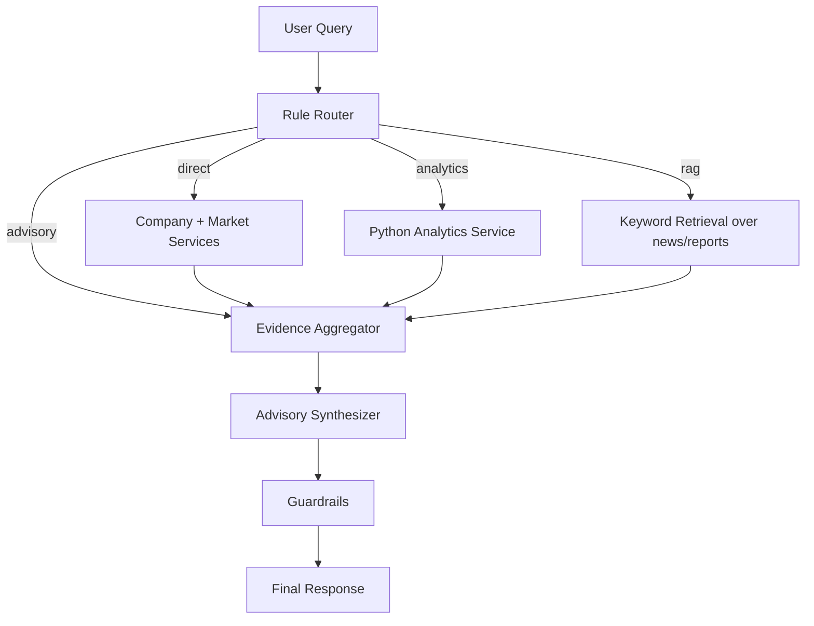

# Architecture Notes

## Direct path
- Company listing/exchange and market summary use SQLite only.

## Analytics path
- SMA20, RSI14, return are computed by deterministic Python (`numpy`).

## RAG path
- MVP uses deterministic keyword retrieval from `news` and `reports` tables (fallback instead of Chroma due local build constraints).
- Retrieval is only for unstructured text evidence.

## Advisory path
- Advisory uses only `AnalyticalContext` snapshots and evidence, no direct raw fetch.

## Guardrails
- Validate evidence presence and numeric source coverage.
- Add demo warning and mandatory financial disclaimer.

## Mocked scope
- All data is deterministic mock seed data.
- No realtime feeds, no personalized investment profiling.
